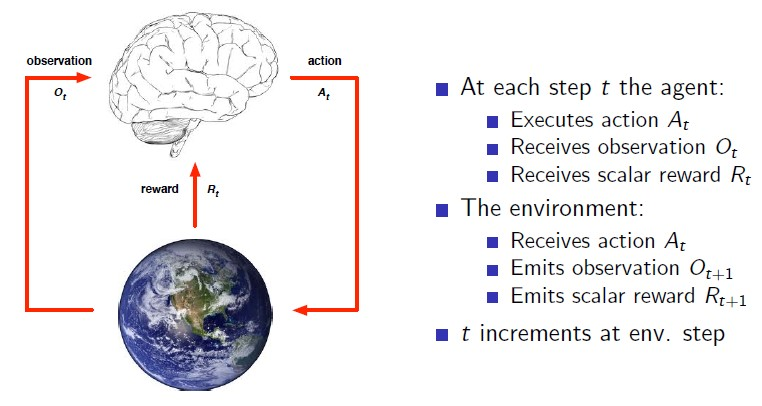
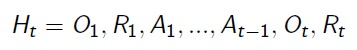
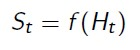
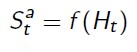
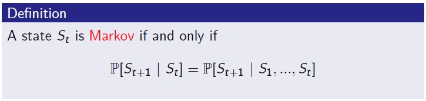
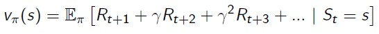
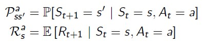
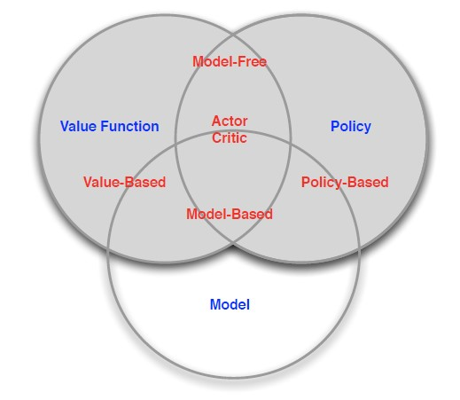

# 1. Introduction to Reinforcement Learning

## 1.2. About Reinforcement Learning

### Characteristics of Reinforcement Learning

RL이 다른 ML 방법과 다른 이유?
* 좋고 나쁨을 판단할 supervisor가 없으며, reward값 만을 활용한다.
* sequential decision에 대하여 즉각적으로 feedback을 진행하지 않는다.
* 시간적인 요소가 작용한다(특정 episode에 대하여 순서가 중요하다.).
* agent의 action이 추후에 받을 state에 영향을 준다.

## 1.3. The Reinforcement Learning Problem

### Reward
reward는 agent의 action(step)에 대한 scalar feedback이다. agent는 누적 reward를 최대화하려고 한다.

i.e. 문제가 너무 복잡해서 reward를 벡터로 줄 수 밖에 없는 경우에는 다른 방식으로 문제를 해결해야 한다.

다시 말해, RL은 Reward Hypotheis을 기반으로 이루어진다고 할 수 있다.

* Def. Reward Hypotheis

    All goals can be described by the maximisation of expected cumulative reward

    강화학습 문제에 대한 모든 목적은 누적 보상의 기대값을 최대화하는것으로 묘사할 수 있다.

#### Sequential Decision Making (Objective of RL)

* Goal: total future reward를 최대화하는 action을 선택하는 것
* Action의 결과는 장기적으로 나타난다.
* Reward는 지연될 수 있다.
* 때때로는, 미래의 long-term reward를 위해 현재의 reward를 희생할 수 있다(not greedy consistantly).

### Environment

agent의 action(step-행동의 단위)은 environment로 부터만 영향을 받으며, environment는 agent의 action을 받아 그에 해당하는 observation과 reward를 반환한다.

### History and State

**History**는 아래와 같이 **Observation, Reward, Action** element의 순서로 이루어진 결과값이다.

따라서, 이 history를 기반으로,

* agent가 action을 선택하고,
* environment가 observation과 reward를 반환한다.

**State**(Function of History - History에 있는 정보를 가공하여 가져오는 것.)는 다음으로 어떤 일이 일어날지를 결정하는 정보이며, 아래와 같이 나타낼 수 있다(Important than history).

* Environment State 

    Environment만 알고있는 정보로써, agent에는 blackbox의 영역이다.

* Agent State  - 다음 action을 취하는데 있어서 필요한 정보.

    Agent의 action(step)에 의해 Environment가 반응한 observaion과 reward를 임의의 agent function f를 거친 결과를 일컫는다.

    

    
    
    

* Informational State(by definition of Markov state)

    

    
    
    

    State가 Markov한가 아닌가? - Action을 결정하는데 있어서 **그전의 State만 고려하여 결정하는가?** (현재는 과거와 독립적이다.)

    이를 따르면, State는 'Markov State'이다.
    (S1부터 St까지의 모든 state가 정의되어 있더라도, t시점의 state만으로 t+1시점의 state가 결정되는 것)

    대부분의 RL은 Markov State에서 작동한다.
    
    i.e. driving helicopter

* Fully Observable Environment (Markov Decision Process; MDP)

    Agent state = environment state = information state

* Partially Observable Environment (Partially Observable Markov Decision Process; POMDP)

    Agent state  enviornment state

    i.e) 포커에서 공개패를 제외한 다른 사용자의 패를 알 수 없는 상황

## 1.4. Inside An RL Agent

3가지 모두를 다 가지고 있을지도 or 아닐 수도 있음.

1. Policy: agent's behavior function

    * Deterministic
    * Stochastic - state에서 확률에 의해 action이 선택

2. Value Function: how good is each state and / or action - 상황이 얼마나 좋은지 (depends on policy)

    prediction of future reward for evaluating goodness or badness of state

    

    
    
    

    어느 State로부터 policy(pi)를 따라갔을때 얻을 수 있는 총 받을 수 있는 reward의 기대 값.
    
    Why expectation value?

    같은 state에서도 확률에 따라서 reward가 달라지기 때문이다. 
    
    그렇다면, deterministic policy에서는 expecation을 취할 필요가 없지 않는가?

    state에서 action을 취함에 있어 확률이 없을 수 있지만, action을 취하는데 있어 environment에서 받는 확률적인 영향도 있을 수 있다. 따라서 expectation을 취한다.

3. Model: Agent's representation of the environment - 환경이 어떻게 될지 예측 (Agent의 입장에서)

    예측 대상
    1. Reward
    2. Transition Probability

    state를 받아 reward나 transition을 도출하는 행위는 environment가 수행함.

    environment에 action을 가할때 어떤 Transition과 reward를 얻을지 예측하는 predicator

    

    
    
    

4. Categorizing RL Agent

    

    
    
    

    * Value Based
        * Value Function 
    * Policy Based
        * Policy
    * Actor Critic
        * Policy
        * Value Function
    * Model Free
        * Policy and / or Value Function 
    * Model Based
        * Policy and / or Value Function 
        * Model  

## 1.5. Problems within RL

RL and Planning for Sequential Decision Making

* RL
    * unknown environment
    * interact with env
    * agent improve policy

* Planning(Search)
    
    Agent already knows about environment **(about reward and transition)** of problem. 

    i.e. monte-carlo tree search

Exploration vs Exploitation

* Exploration: find more information about env

* Exploitation: exploit known infomation to maximize reward

Predction vs Control

* Prediction: evaluate the future

    policy가 주어졌을 때 평가하는것, value function을 학습시킨다.

    state에 대한 value를 찾는 것.

* Control: optimize the future

    finding best policy

    state에서 어떻게 움직여야 하는지를 찾는 것.