# 2. Markov Decision Process

## Reference

<a href="https://dnddnjs.gitbooks.io/rl/content/">https://dnddnjs.gitbooks.io/rl/content/</a>

## 2.1. Markov Process

MDP - environment를 완벽히 관찰할 수 있는 상태.

### Markov Property

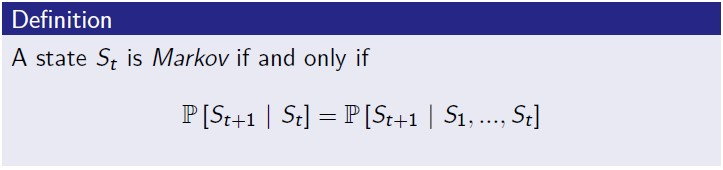

초기 상태부터 현재 상태까지의 History에 대해서 다음 State 결정시 현재의 State만으로 다음 시점의 상태를 결정하게 되면 현재 상태는 Markov 성질을 따른다고 할 수 있다.

현재 시점 이전의 모든 상태는 history 형태로 현재 시점에 관련성이 포함되어 있다.

**State Transition Matrix**

Markov 성질을 가지는 state s와 다음 state인 s-prime에 대한 전이확률은 아래와 같으며, 이런 전이확률들을 모아둔 matrix를 P로써 아래와 같이 나타낼 수 있다.

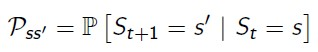
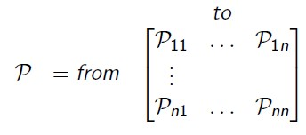

임의 하나의 state(one row)에서의 전이확률의 합은 1이다.

### Markov Process(Markov Chain)

Markov Process는 마르코프 성질을 띄는 임의의 State S1,S2,...(discrete)에 대해 memoryless한 random process를 말한다.

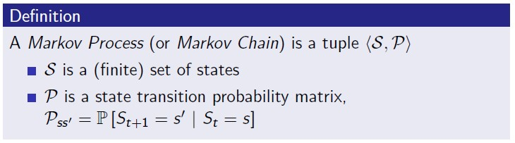
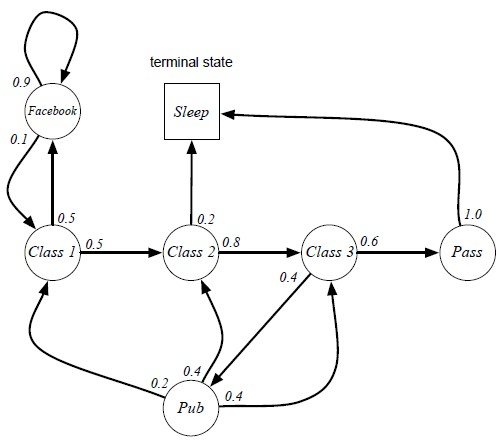

위와 같은 markov chain으로 시작 State(Class1; S1)을 기반으로 terminal state(Sleep)까지의 State들의 연속으로 구성된 sample(episode)을 구성할 수 있다.

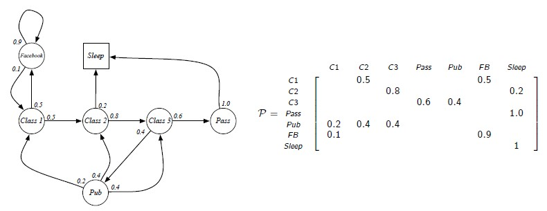

## 2.2. Markov Reward Process

Markov Chain에서 Reward와 discount factor를 추가한 과정을 Markov Reward Process라고 한다.

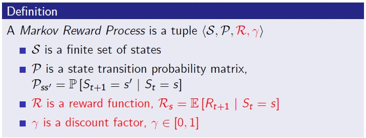
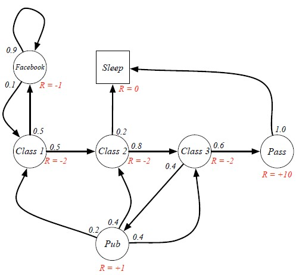

### Return(Total Reward from time-step t)

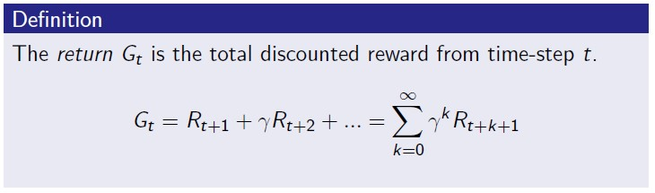

현재 t시점의 state에서 얻을 수 있는 총합 Reward(G[t])는 state에 진입함으로써 얻는 즉각적인 Reward(R[t+1])에 할인된 미래의 Reward를 합한 값이다.

할인계수(discount factor)는 0에서 1사이의 값을 가지며,
* 0인 경우, 현재와 가까운 보상에 가중치를 부여
* 1인 경우, 미래 보상에 대해 가중치를 부여

#### 왜 discount factor를 적용하는 것일까?

* 수학적으로 reward를 다루는데 용이
* terminal state를 끝까지 거치지 않는 경우 보상 값이 끊임없이 증가하기 때문에 결과를 수렴하기 위해서
* 미래의 불확실성을 나타내기 위함
* Agent의 성질을 반영하기 위해서(i.e. Financial vs Animal/Human)

### Value Function

starting state s로부터 얻을 것으로 기대되는 최대 보상 값을 반환하는 함수

Expectation을 하는 이유는, 임의의 state에서 다른 state로 전환되는 과정이 확률을 따르기 떄문이다.

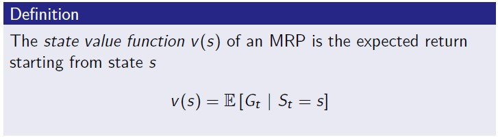

임의의 State C1으로 부터 시작하는 모든 G1들에 대한 기대값을 계산하는 것이 value function v(t)

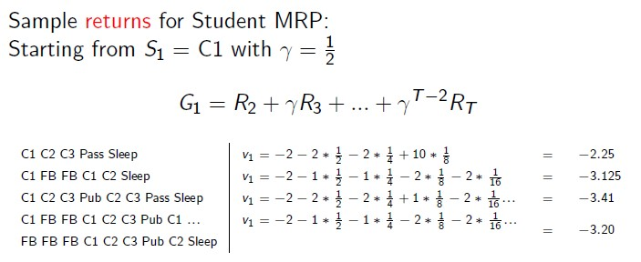
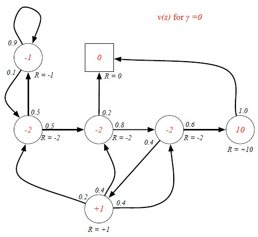

만약, 할인 계수를 0으로 하여 G[t] 계산 시 현재의 reward만 감안하게 되면, v(t)를 통한 값은 해당 state 진입을 위해 치르는 Reward만 반영하는 것이다.

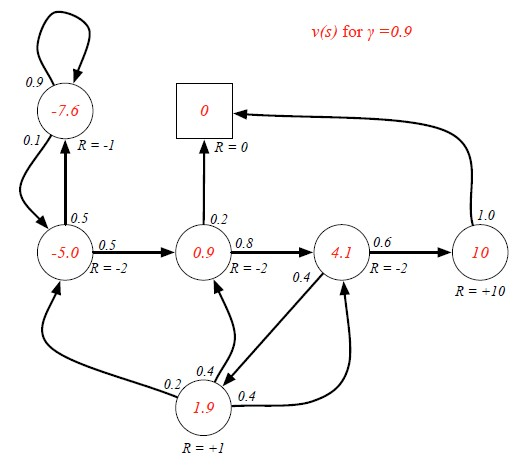
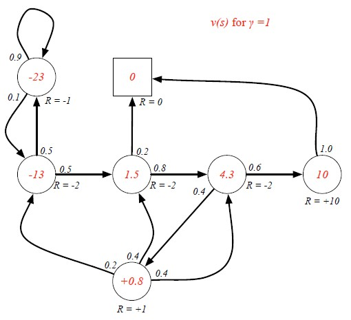

### Bellman Equation for MRPs

각 state의 value function을 거친 value값을 계산하기 위한 방정식

방정식은 크게 두 가지로 나눌 수 있다.

* St로 인해 얻게되는 즉각적인 보상 
* 후속 state의 value function 값에 할인된 가치로 얻는 보상 })

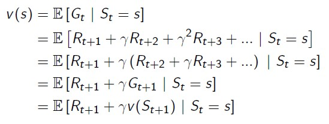
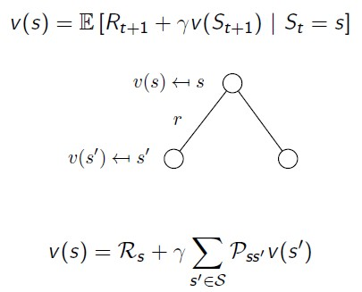

white dot은 MRP에서 하나의 State에 대응된다. 현재 state s에 대한 v(s)는 즉각적으로 얻는 반응 Rs와 다음으로 전이되는 State들의 v(s prime)과 전이확률을 곱한 값들의 합으로 나타낼 수 있다. (확률과정에서의 Expectation(기대값) 계산)

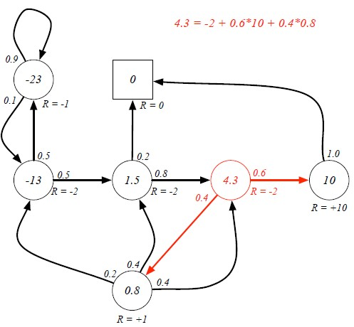

#### Bellman Equation for Matrix Form

특정 State의 value는 즉각적인 Reward를 담은 Matrix R, discount factor gamma, State간 전이확률 P Matrix, 각 state에서 현재 가지고 있는 value  function Matrix값을 가지고 아래와 같이 나타낼 수 있다.

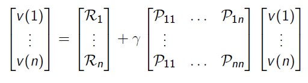

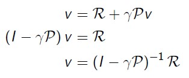

행렬을 활용한 식으로 나타낼 수 있기 때문에 위와 같이 value function 계산을 위한 수식을 간단히할 수 있다.

## 2.3. Markov Decision Process

MDP는 MRP와 다르게 A(action)이 추가된 Markov 과정이다.

예시 MRP와 비교했을때, node에 있었던 선택지 값들이 edge로 변화되었다.

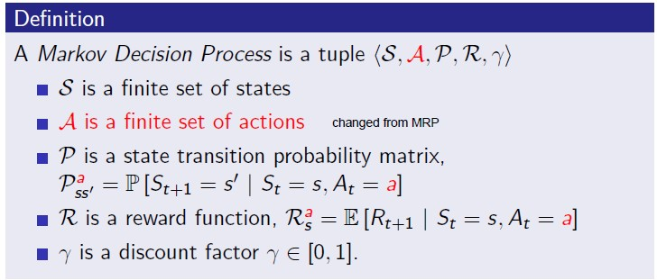
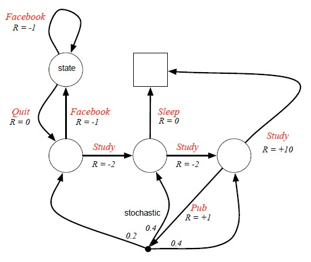

### Policy

policy(정책)은 임의의 state에서 Action의 집합 At에서 정의된 특정 action을 취하는 확률로 나타낼 수 있다.

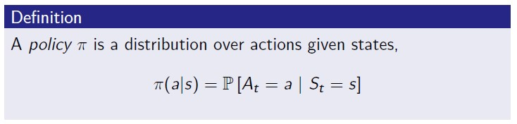
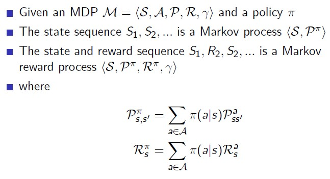

### Value functions

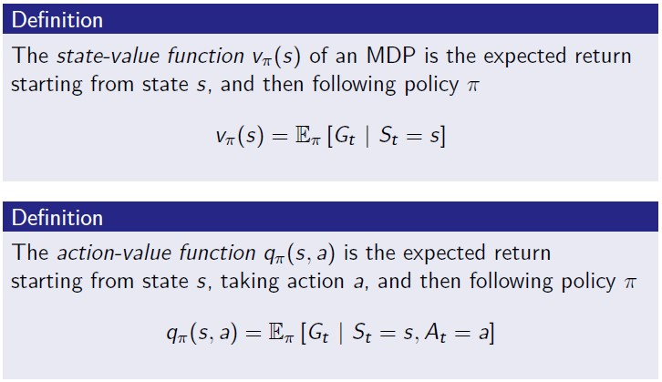

state-value function은 state에서 최대로 얻을 수 있는 reward를 의미

action-value function은 action을 취함으로써 얻는 최대 reward를 의미.

### Bellman Expectation Equation

특정 state에서 취할 수 있는 action별로 얻을 수 있는 최대 reward를 구하는 q value 추론 과정

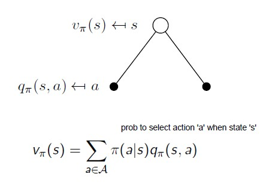

특정 state s에서 얻을 수 있는 value function은 취할 수 있는 action들의 action-value function값 X policy

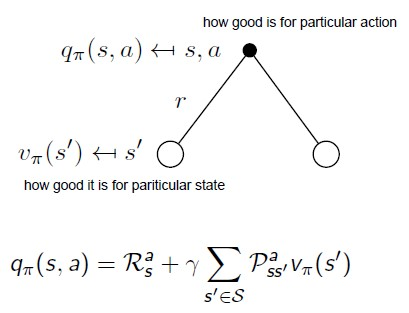

특정 action을 취함으로써 얻는 reward와 특정 action으로 인해 변환될 수 있는 state의 value function 결과값을 할인한 
결과를 합한다.

위의 두 도식을 활용하면 한 state의 value function은 아래와 같다.

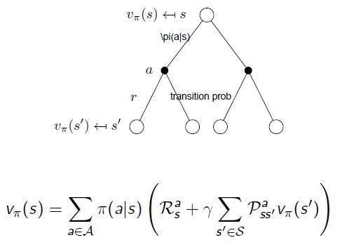

두 도식을 거꾸로 활용한 한 action-value function의 계산은 아래와 같다.

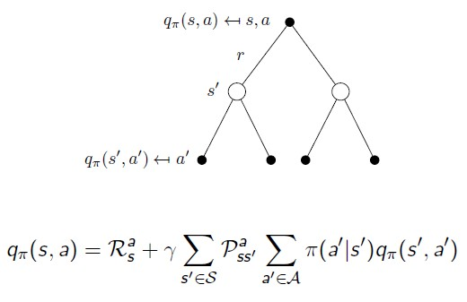

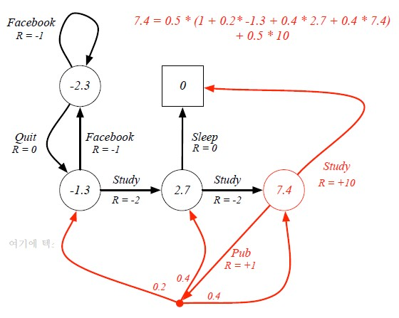

특정 state의 value function v(t)의 계산 예시

Bellman equation in Matrix Form

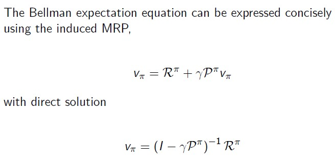

### Optimal Value Function

앞서 열거한 방식으로 계산한 state-value / action-value function에 대해 Optimal한 Value를 추정한다.

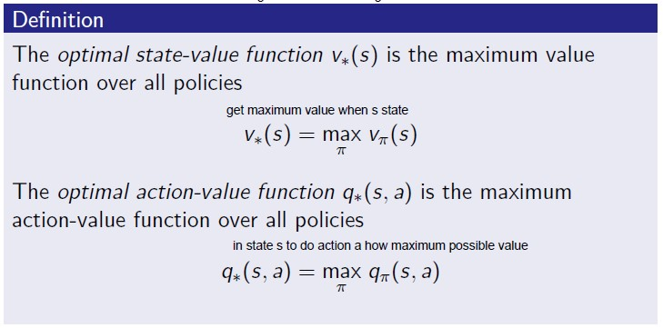

### Optimal Policy

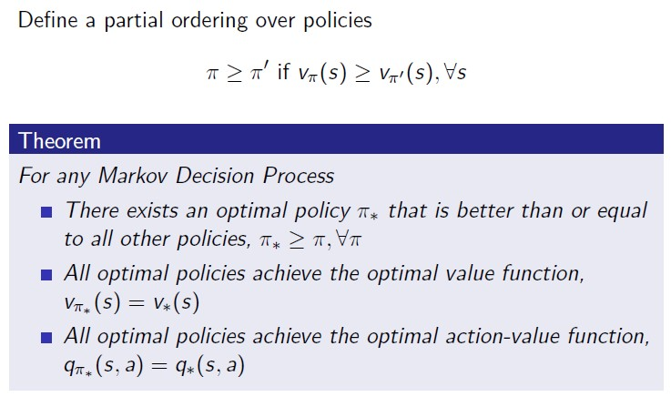

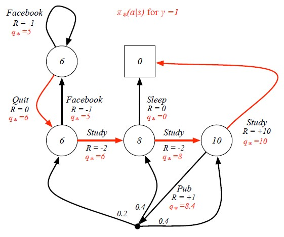