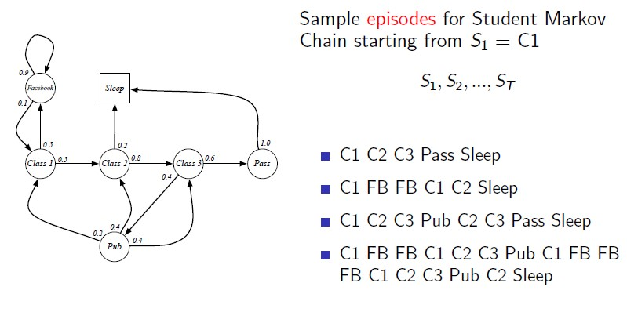
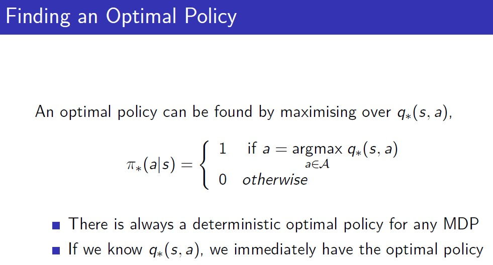
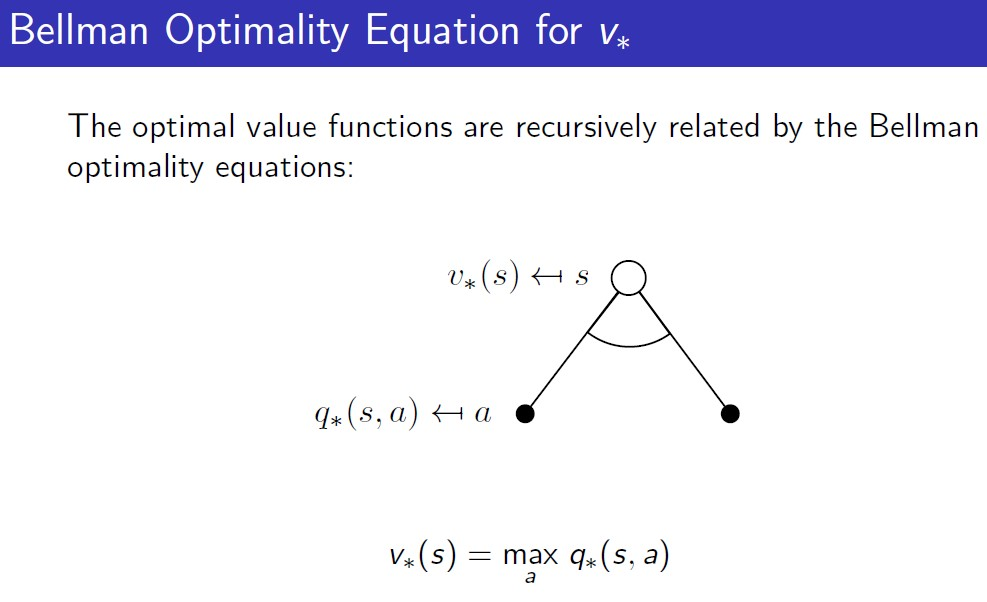
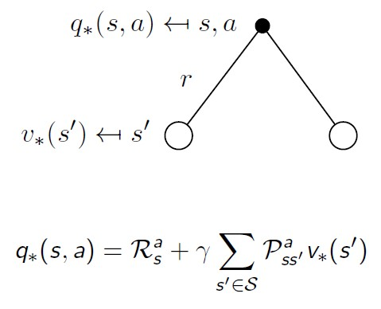
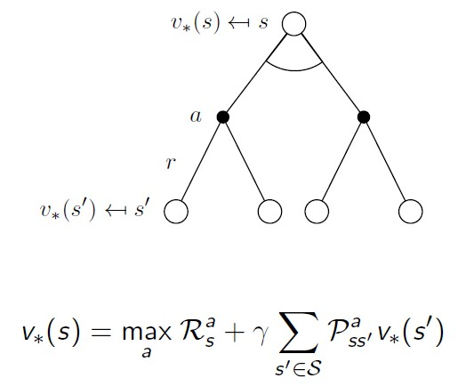
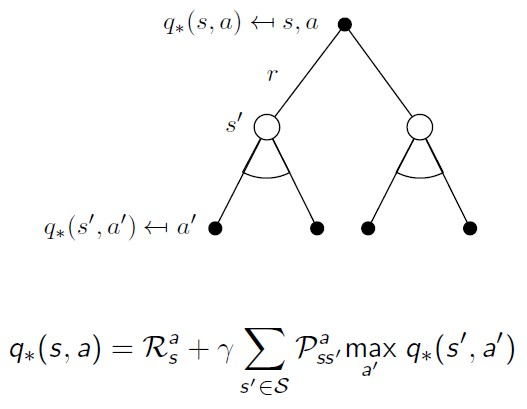
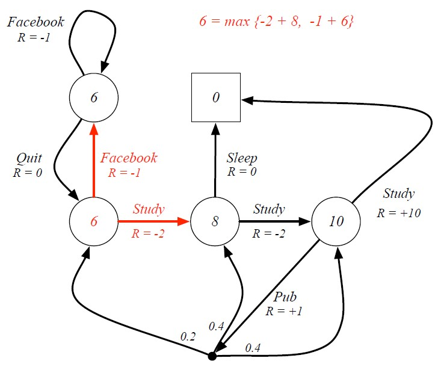

# 2. Markov Decision Process

## Reference

<a href="https://dnddnjs.gitbooks.io/rl/content/">https://dnddnjs.gitbooks.io/rl/content/</a>

## 2.1. Markov Process - 환경이 어떤 형태로 동작하는지에 대한 Dynamic을 정의

MDP - environment를 완벽히 관찰할 수 있는 상태.

### Markov Property

초기 상태부터 현재 상태까지의 History에 대해서 다음 State 결정시 현재의 State만으로 다음 시점의 상태를 결정하게 되면 현재 상태는 Markov 성질을 따른다고 할 수 있다.

현재 시점 이전의 모든 상태는 history 형태로 현재 시점에 관련성이 포함되어 있다.

**State Transition Matrix**

Markov 성질을 가지는 state s와 다음 state인 s-prime에 대한 전이확률은 아래와 같으며, 이런 전이확률들을 모아둔 matrix를 P로써 아래와 같이 나타낼 수 있다.

임의 하나의 state(one row)에서의 전이확률의 합은 1이다.

### Markov Process(Markov Chain) 

Markov Process는 마르코프 성질을 띄는 임의의 State S1,S2,...(discrete)에 대해 memoryless(어느 경로를 통해 State에 오는지는 관계 없음)한 random process(Sampling이 가능하다는 의미)를 말한다.

** 추가.

State Transition Matrix에 특정 조건을 만족하면, Markov process의 분포가 stationary가 됨. -> State들에 머물러 있는 Agent들의 수가 모두 동일함. 

위와 같은 markov chain으로 시작 State(Class1; S1)을 기반으로 terminal state(Sleep)까지의 State들의 연속으로 구성된 sample(episode)을 구성할 수 있다.

**episode를 샘플링한다?**

확률변수로부터 simulation을 수행한 하나의 episode는 'Sampling'하는 하나의 과정을 말함.

Transition probability via matrix

## 2.2. Markov Reward Process

Markov Chain에서 Reward(function; 특정 state에서 어떤 reward를 부여할 것인가?)와 discount factor를 추가한 과정을 Markov Reward Process라고 한다.

### Question

Q. Reward를 State 방문시가 아닌, State간에 연결된 edge에 부여할 수는 없을까요?

A. 현재는 State 전이시, Action이 정의되어 있지 않다. State에서 다른 State로 전이되는 것은 확률에 의해서 전이되므로 State를 방문하는 경우에만 Reward를 부여한다. 

### **Return(Total Reward from time-step t)**

Return은 강화학습을 학습시키는 중요한 메커니즘에 관련된 정의.(not equal with Reward)

현재 t시점의 state에서 얻을 수 있는 총합 Reward(G[t])는 state에 진입함으로써 얻는 즉각적인 Reward(R[t+1])에 할인된 미래의 Reward를 합한 값이다.

할인계수(discount factor)는 0에서 1사이의 값을 가지며,
* 0인 경우, 현재와 가까운 보상에 가중치를 부여
* 1인 경우, 미래 보상에 대해 가중치를 부여

#### 왜 discount factor를 적용하는 것일까?

* (근본적인 이유) **수학적으로 reward를 다루는데 용이** - discount로 인해 수렴성이 증명되어 크기를 비교할 수 있다. 
* terminal state를 끝까지 거치지 않는 경우 보상 값이 끊임없이 증가하기 때문에 결과를 수렴하기 위해서
* 미래의 불확실성을 나타내기 위함
* Agent의 성질을 반영하기 위해서(i.e. Financial vs Animal/Human)
* 모든 Sampling되는 episode가 terminate 하다면, gamma=1로 하여도 될 것이다. 

### Value Function - Return의 기대값

starting state s로부터 얻을 것으로 기대되는 최대 보상 값을 반환하는 함수

Expectation을 하는 이유는, 임의의 state에서 다른 state로 전환되는 과정이 확률을 따르기 때문이다.

**-- Gt가 확률에 의해 변하는 확률변수이기 때문이다.**

임의의 State C1으로 부터 시작하는 모든 G1들에 대한 기대값을 계산하는 것이 value function v(t)

C1에서 시작해서 Episode별로 확률에 의해 서로 다른 결과를 Return함. 

만약, 할인 계수를 0으로 하여 E[G[t]] 계산 시 현재의 reward만 감안하게 되면, v(t)를 통한 값은 해당 state 진입을 위해 치르는 Reward만 반영하는 것이다.

### **Bellman Equation for MRPs**

Value Function이 학습되는 machanism

각 state의 value function을 거친 value값을 계산하기 위한 방정식

방정식은 크게 두 가지로 나눌 수 있다.

* St로 인해 얻게되는 즉각적인 보상 
* 후속 state의 value function 값에 할인된 가치로 얻는 보상 })

white dot은 MRP에서 하나의 State에 대응된다. 현재 state s에 대한 v(s)는 즉각적으로 얻는 반응 Rs와 다음으로 전이되는 State들의 v(s prime)과 전이확률을 곱한 값들의 합으로 나타낼 수 있다. (확률과정에서의 Expectation(기대값) 계산)

#### Bellman Equation for Matrix Form

특정 State의 value는 즉각적인 Reward를 담은 Matrix R, discount factor gamma, State간 전이확률 P Matrix, 각 state에서 현재 가지고 있는 value  function Matrix값을 가지고 아래와 같이 나타낼 수 있다.

행렬을 활용한 식으로 나타낼 수 있기 때문에 위와 같이 value function 계산을 위한 수식을 간단히할 수 있다.

## 2.3. Markov Decision Process

MDP는 MRP와 다르게 A(action)이 추가된 Markov 과정이다.

예시 MRP와 비교했을때, node에 있었던 선택지 값들이 edge로 변화되었다.

'Pub'의 경우 Action을 한다고 무조건 임의의 State로 움직이는 것이 아닌 **'확률'이 관여함**.

이는 s에서 s-prime으로 이동시 a가 관여한 확률의 전이확률 Matrix로 나타나며, 이는 꽤나 복잡한 Matrix(n^2 X m^2)로 나타난다.

### Policy(Agent가 가지고 있는 값)

-- MRP에서는 State에 머무르고 있으면 임의의 확률분포에 의하여 다음 State로 넘겨줌으로 Policy가 존재하지 않았음. 

MDP에서는 Action에 의해 State가 달라지기 때문에 Action에 대한 Policy가 필요함. 

policy(정책)은 임의의 state에서 Action의 집합 At에서 정의된 특정 action을 취하는 확률로 나타낼 수 있다.

MDP에서 **이미 Policy가 지정(고정)되어있다고 하면**, 방문할 State에서 Policy를 가지고 Action을 하지만, 그 Action에 대해서도 State Transition 가 있어서 다음 State로 연결된다. 이 전체적인 과정을 엮으면 Markov Process로 볼 수 있다. 

-- 내가 임의의 State에 있을때 Policy로 인해 어떤 State가 될 것인지 계산할 수 있다. 

그리고, State와 Reward의 Sequence는 MRP가 된다. 

### Value functions(w/ policy(pi))

MRP와 동일하되, policy가 주어지고 이를 따라서 Value 값을 최대화 하는 value function을 찾는 것.

**state-value** function은 state에서 최대로 얻을 수 있는 reward를 의미

**action-value** function은 action을 취함으로써 얻는 최대 reward를 의미.

### Bellman Expectation Equation

특정 state에서 취할 수 있는 action별로 얻을 수 있는 최대 reward를 구하는 q value 추론 과정

특정 state s에서 얻을 수 있는 value function은 취할 수 있는 action들의 action-value function값 X policy

특정 action을 취함으로써 얻는 reward와 특정 action으로 인해 변환될 수 있는 state의 value function 결과값을 할인한 
결과를 합한다.

위의 두 도식을 활용하여, 두 단계로 확장하여 표현하면 v와 q는 아래와 같다..

두 도식을 거꾸로 활용한 한 action-value function의 계산은 아래와 같다.

특정 state의 value function v(t)의 계산 예시

Bellman equation in Matrix Form

### Optimal Value Function

앞서 열거한 방식으로 계산한 state-value / action-value function에 대해 Optimal한 Value를 추정한다.

어떤 policy를 따르든(가능한 모든 policy들에 대해), 제일 나은 value function.

Optimal value function을 구하는 것은 MDP에서 가장 최적의 성능을 보여주며, MDP를 해결했다고 표현할 수 있다. 

### Optimal Policy

두 policy가 있을때 어느 것이 더 좋은지 비교하는 방법? - 모든 state에 대해서 v-pi-s가 v-pi-prime-s가 더 큰 경우 특정 policy가 더 좋다고 비교할 수 있다. 

정리. 

* 모든 MDP에 대해서, optimal policy가 존재
* optimal policy를 따라갔을 때, 결과적으로는 v와 q에 대해서 optimal function을 찾을 수 있다. 

결과적으로 q\*를 구했다고 생각했을때, 임의의 state에서 q\*들 중 maximum한 경우로만 연결되는 policy로 변경하면 이는 optimal policy로 정의할 수 있다. 

따라서, 모든 MDP에는 항상 **deterministic optimal policy**(policy는 본래 stochastic 하지만,)가 존재한다고 할 수 있다. - 왜냐하면 MDP의 정리에 따르면 모든 MDP에는 optimal policy가 존재한다고 했기 때문이다.

q\*의 경우에도 v\*와 마찬가지로 deterministic optimal policy를 가지게 될 것이다. 

### Bellman Optimality Equation

특정 State에서 action을 취함으로써 얻는 value function q-function에 대하여 높은 값을 가지는 action을 따르는 것이 최적의 state value function이 된다. 

각각의 state value function, action value function v와 q를 두단계로 확장하여 표현하면 Expectation과 동일하게 다음 value function을 활용하여 나타낼 수 있다. 

Optimal Equation은 max로 인해 linear equation이 아니다. 이는 closed form으로는 문제를 풀 수 없음.

Bellman Optimality Equation을 해결하는 것은 max로 인해 linear하지 않기 때문에, 해가 없다.