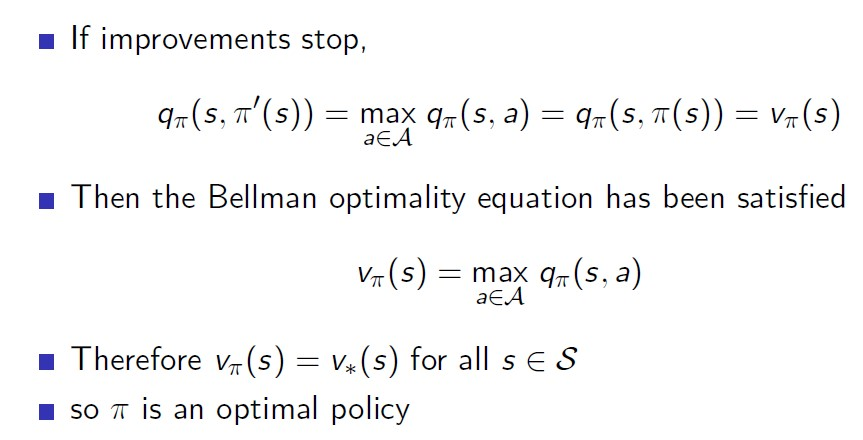
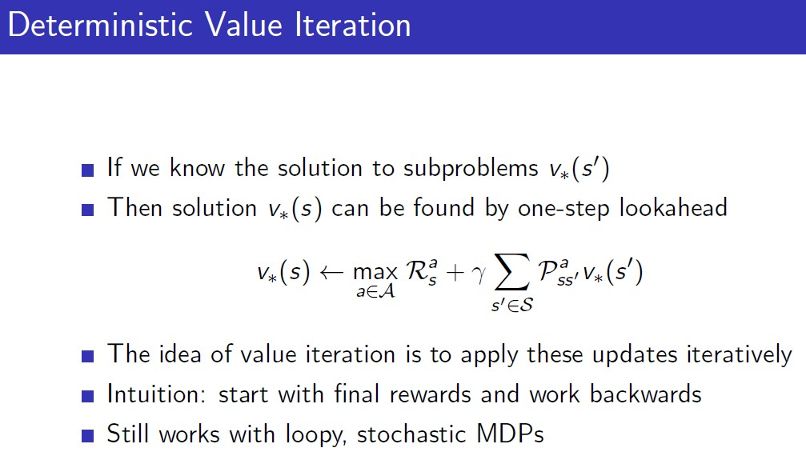
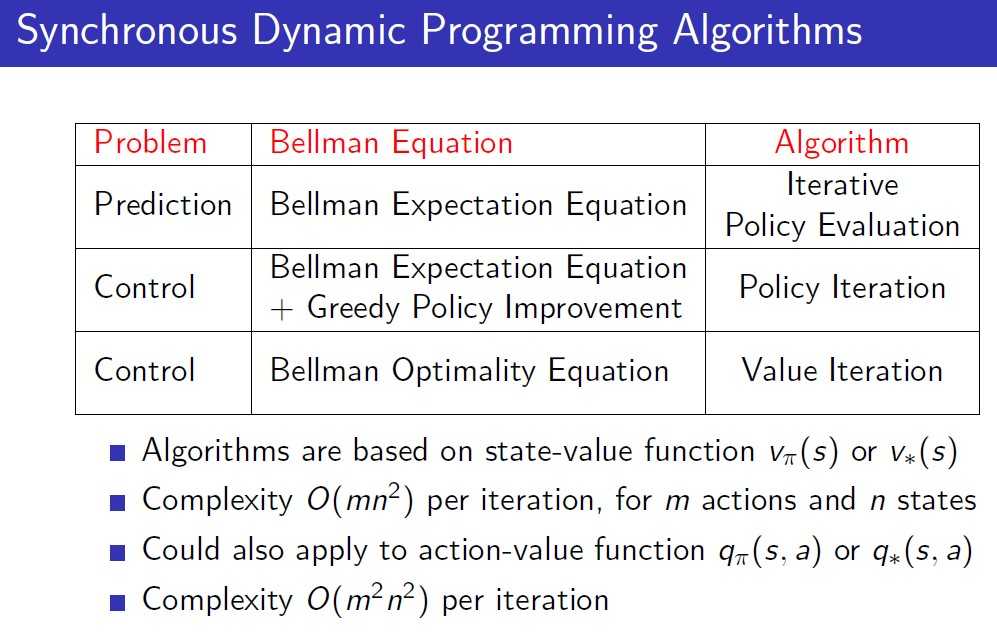
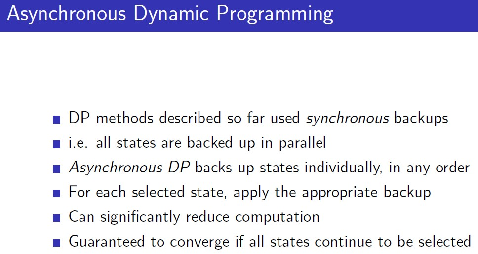

# 3. Planning by Dynamic Programming

Dynamic Programming을 통해 MDP('Planning')를 해결하는 Process에 대해서 알아본다.

## reference

https://dnddnjs.gitbooks.io/rl/

https://mynsng.github.io/reinforcement%20learning/2020/02/15/DSRL-03/

https://sumniya.tistory.com/10

## 3.1. Introduction

Dynamic Programming
* Dynamic: 임의의 문제를 sequential하게 해결
* (Mathematical) Programming: 문제를 최적화하는 행위 i.e. policy in MDP

Dynamic Programming 문제를 해결하는 것은 하나의 문제를 하위 문제로 지속적으로 나누어 해결하고 결합하는 것이다. (divide and conquer)

MDP를 해결하기 위해 사용한 bellman equation은 현재의 reward와 현재가치로 할인한 미래 시점의 bellman 방정식의 합으로 나타낼 수 있기 때문에 DP 방식으로 문제에 접근할 수 있다.

DP 방식은 MDP에 대해 모든 것을 알고 있는 상태(보상과 전이확률)를 가정하고 사용한다.

각 state 별로 policy를 따르는 value값을 예측하기 위한 **prediction 절차**와(policy의 optimal value 계산),

이를 바탕으로, 최적의 policy를 구하는 **control 절차**로 구성된다(policy optimal value로 새로운 policy 계산).

## 3.2. Policy Evaluation (Prediction) 

-- policy가 정해져있을 때, 이 policy를 따라가면 value function이 어떻게 되어있을지 학습하는 것(objective: finding policy).

주어진 policy(pi)를 평가하기 위한 방법으로는, Bellman expectation 방정식을 loop를 통해 계산한다.

초기값으로 value값을 0으로 모두 세팅하고, iteration을 통해서 policy를 따랐을 때의 value function을 찾는 것을 일컫는다. 

**backup(==memory)**

Synchronous backup, 모든 state들에 대해서 한번씩 update를 진행하는 방법. 현재 state의 value를 update하기 위해 다음 state값을 활용하여 현재 iteration의 현재 state의 value값을 update한다. 

특정 state에서 도달 할 수 있는 state들의 value 값을 가지고 현재 state의 value 값을 iterative하게 변경하는 것.

### Example: Small Gridworld

grid world example에 대해 1행 2열의 값 변동에 대해서만 자세히 알아보자.

k=0, 모든 value function의 값은 0으로 setting해둔다.

k=1, (1,2)포인트에서 이동할 때 발생하는 reward는 1이고 v0는 모든 점에서 0임을 반영하면,

k=2, k는 1일때와 달리 v1부터는 0이 아닌 값을 가지기 떄문에 할인하여 계산하는 부분(but, gamma=-1)을 계산해 주어야 한다.

상하좌우(1/4)로 이동시 벽에 부딪히는 경우는 bounce back한다.

도착한 state의 value값을 할인하고 reward를 더하여 policy를 반영한 값들을 summation.

점점 특정 point에 대해 value function update를 위한 state의 수를 확장하게 되면 random policy에 대한 true function을 구할 수 있게 된다.()

Saying by Silver.

바보같은 Random Policy(0.25 per direction)를 evaluation만 했고, 평가된 Policy를 greedy 하게 움직이는 것 만으로도 Optimal policy에 도달 할 수 있다.

## 3.3. Policy Iteration (Control)

1. policy를 평가 - value function을 찾고.
2. policy를 improvement - value function을 greedy하게 가져가는 방향으로 policy를 수정.

이 둘을 반복하게 되면 최적 policy인 pi-star에 근접하게 될 것이다. 

Policy Evaluation은 특정 MDP가 가지고 있는 Policy를 가지고 value function을 update하는 것이다.

Policy Iteration은 update한 value function()에 대해 greedy한 방식으로 행동하여 Policy를 향상시키는 것이다.

greedy하게 policy를 향상시키는 방식은 다음 state의 value function이 큰 곳으로 향하도록 action을 취하는 것이다.

증명하고자 하는것, Policy Improvement한 방식으로 하면 이전 policy보다 더 나아지는가?

policy -> deterministic(greedy) way policy.
q에 대해 greedy 하게 움직이게 되면 pi-prime은 기존의 pi보다 낫다는 것을 증명하고자 한다. 

특정 State s인 상태에서 진행하는 하나의 step에 대해,

(q-function의 정의)s에서 policy(pi)를 따라가는 것과 s에서 policy에 의해 도출된 action을 취한 후의 policy를 따라가는 것이 동일하다.

그리고, s에서 policy에 의해 도출된 action을 취한 후의 policy를 따라가는 것은 s에서 policy에 의해 도출된 action을 취한 후의 policy를 따라가는 것들 중에 max값을 취한 것보다 작거나 같다.

이렇게 따라갔을 때, max는 greedy policy를 따랐을 때의 q값을 나타낸다. 

이를 iterative하게 확장하는 경우 네번째 전개식과 같이 pi prime으로 개선된 다음의 policy는 그전의 policy보다 최적이다(bellman-equation을 역으로 전개하여 policy가 개선되는 것을 증명).
 
))은 첫 step은 pi-prime을 따라서 step을 하되, 그 다음 step은 기존의 policy를 따라서 step한다는 의미. 그래서 이는 처음부터 pi를 따라가는 )) 보다 큰것은 당연한 일(due to argmax). 한 step에서 따지고 보면 더 좋기 때문에, 더 많은 step들로 iteration함으로써 얻는 pi-prime은 더 좋은 policy가 된다. 

만약, policy의 개선이 첫 번째 수식과 같이 멈추게 될때 얻는 policy의 value function은 'Bellman optimality equation'이 된다(local minima 등에 빠지지 않고,). 

## 3.4. Value Iteration(w/o policy)

Policy Iteration과 달리 Bellman Optimal Equation을 활용한다.

특정 state s에서 최적 value function을 구하려면, s의 다음 state들인 s-prime에서의 최적 value function을 알고 있으면 가능하다. 

이를 이용해서, s인 상태의 최적 value function을 계산하려면, 'Bellman Optimality Equation'이 사용된다.

Value Iteration을 하는데 있어서, 끝점에서부터 계산을 수행하면 더 빠른 접근이 가능하지만, 실제 상황에서는 어느 곳이 Terminal State인지 알 수 없다. 따라서. 모든 Grid-world의 point들에 대해 Synchronous하게 각각 값을 수정해준다. 

Policy Iteration과 달리 주어진 policy가 없다. 

Value Iteration은 Policy Iteration에서 k값을 1로 하는 것과 동일하다. **이는 Policy Iteration에서 Evaluation을 위한 loop를 1번만 하는 것과 동일하다.**

Bellman Optimality Equation은 Expecation Equation과 달리 다음 칸의 value가 policy를 따랐을 때의 value가 아니라, 다음 칸은 Bellman Optimality Equation을 다시 한 번 적용한 값이다. 

value iteration에서 policy improvement와 같은 과정이 없는 이유는 현재 policy가 optimal하다는 것을 전제하여 value func를 max하기 때문이다.

## Summary

## 3.5. Extensions to Dynamic Programming

### 모든 State point들을 어떻게 방문할 것인가?

* In-Place DP: Synchronous하게 Value function을 변경함에 있어(make k+1 using k), 각각을 위한 두개의 n X n table이 있어야 하지만, 따로 두지 않고 변경된 값을 그대로 활용하는 방식. 

* Prioritised Sweeping: 순서에 우선순위를 두어서 각 state 별 value를 먼저 update. 

* Real-Time Dynamic Programming: Agent가 방문한 State들에 대해서만 변경하는 것. 

### Value값 Update시 어떤 값을 참조하는가? 

* Full-Width Backup: 특정 State에서 값을 변경함에 있어서 그 State에서 이동할 수 있는 모든 Successor state들에 대해  update를 수행. 

* Sample Backup
    * Backup을 하면 그 크기는 항상 일정(overcoming curse of dimensionality)
    * Model을 모르는 경우에도 사용 가능(특정 State에서 다음에 어떤 State로 가는지 모르는 경우)