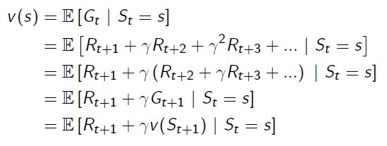

# 3. Planning by Dynamic Programming

Dynamic Programming을 통해 MDP를 해결하는 Process에 대해서 알아본다.

## reference

https://dnddnjs.gitbooks.io/rl/
https://mynsng.github.io/reinforcement%20learning/2020/02/15/DSRL-03/
https://sumniya.tistory.com/10

## 3.1. Introduction

Dynamic Programming
* Dynamic: 임의의 문제를 sequential하게 해결
* (Mathematical) Programming: 문제를 최적화하는 행위 i.e. policy in MDP

Dynamic Programming 문제를 해결하는 것은 하나의 문제를 하위 문제로 지속적으로 나누어 해결하고 결합하는 것이다. (divide and conquer)

MDP를 해결하기 위해 사용한 bellman 방정식은 현재의 reward와 현재가치로 할인한 미래 시점의 bellman 방정식의 합으로 나타낼 수 있기 때문에 DP 방식으로 문제에 접근할 수 있다.

각 state 별로 policy를 따르는 value값을 예측하기 위한 predction 절차와(policy의 optimal value 계산),

이를 바탕으로, 최적의 policy를 구하는 control 절차로 구성된다(policy optimal value로 새로운 policy 계산).

## 3.2. Policy Evaluation (Prediction)

주어진 policy(pi)를 평가하기 위한 방법으로는, Bellman expectation 방정식을 loop를 통해 계산한다.

### Example: Small Gridworld

grid world example에 대해 1행 2열의 값 변동에 대해서만 자세히 알아보자.

k=0, 모든 value function의 값은 0으로 setting해둔다.

k=1, (1,2)포인트에서 이동할 때 발생하는 reward는 1이고 v0는 모든 점에서 0임을 반영하면,

k=2, k는 1일때와 달리 v1부터는 0이 아닌 값을 가지기 떄문에 할인하여 계산하는 부분(but, gamma=-1)을 계산해 주어야 한다.

상하좌우(1/4)로 이동시 벽에 부딪히는 경우는 bounce back한다.

점점 특정 point에 대해 value function update를 위한 state의 수를 확장하게 되면 random policy에 대한 true function을 구할 수 있게 된다.()

## 3.3. Policy Iteration (Control)

Policy Evaluation은 특정 MDP가 가지고 있는 Policy를 가지고 value function을 update하는 것이다.

Policy Iteration은 update한 value function()에 대해 greedy한 방식으로 행동하여 Policy를 향상시키는 것이다.

greedy하게 policy를 향상시키는 방식은 다음 state의 value function이 큰 곳으로 향하도록 action을 취하는 것이다.

## 3.4. Value Iteration

Policy Iteration과 달리 Bellman Optimal Equation을 활용한다.

value iteration에서 policy improvement와 같은 과정이 없는 이유는 현재 policy가 optimal하다는 것을 전제하여 value func를 max하기 때문이다.