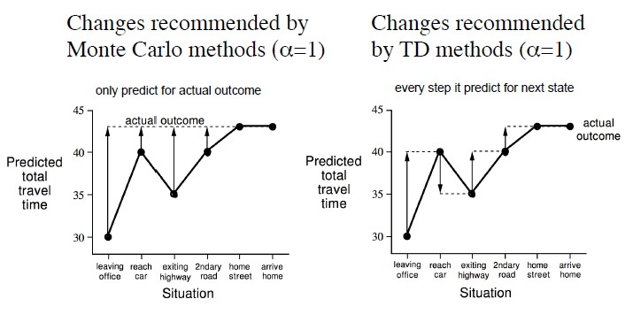
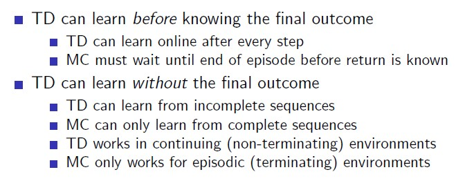
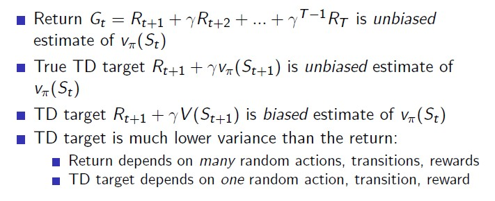
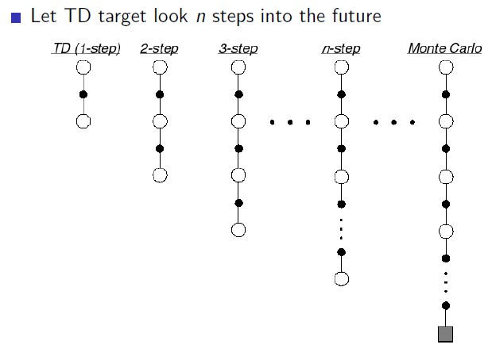

# 4. Model-Free Prediction

## Reference

<a href="https://sumniya.tistory.com/11?category=781573">https://sumniya.tistory.com/11?category=781573</a>

<a href="https://dnddnjs.gitbooks.io/rl/content/mc_prediction.html">https://dnddnjs.gitbooks.io/rl/content/mc_prediction.html</a>

<a href="https://sumniya.tistory.com/14?category=781573">https://sumniya.tistory.com/14?category=781573</a>

<a href="https://dnddnjs.gitbooks.io/rl/content/td_prediction.html">https://dnddnjs.gitbooks.io/rl/content/td_prediction.html</a>

MDP; Model을 안다는 것은, Environment의 전이확률과 Reward function을 안다는 것. 즉, Model-Free는 Environment(MDP에 대한 정보)를 모른 상태로 강화학습을 진행하는 것이다. 

Model-Free에는 'Prediction'문제와 'Control'문제가 존재한다.

* 'Prediction'은 policy가 주어졌을때 최적의 value function을 찾는 문제

* 'Control'은 value function을 가지고 최적의 policy로 변환하는 문제

## 4.2. Monte-Carlo Learning

** the concept of MC는 실제로 구하기 어려운 값을 경험적으로(여러번의 시행을 통해; empirical way) 구하는 방법론.

* MC는 episode들로 쌓이는 experience를 학습
* model-free방식: DP 방식과 달리 MDP **전이확률 및 보상에 대한 모든 정보 없이**도 학습이 가능
* no bootstrapping: 모든 episode는 terminal state로 끝나야 한다
* value = mean return(avg sample's values)을 충족하는 방식으로 학습을 수행

3번째 수식에서, Expectation을 하는 이유는 우리가 사용하는 Return(Gt)가 확률변수이기 때문이다(in chapter2). 

### First-Visit and Every-Visit

MC에서 Episode들에 대해 방문시마다 count를 하나 증량한다. 그런데, 임의의 Episode에는 특정 state가 여러번 등장할 수 있다. 여러번 방문한 count를 어떻게 처리할 것인지에 따라 다르다. 

전제) Policy가 모든 State들을 골고루 방문하도록 정의되어 있어야 한다. 

First-Visit: MC에서 한 episode의 특정 state에 대해 Evaluate하는데 있어 처음 방문한 한번에 대해서만 Return을 계산

Every-Visit: 방문할 때마다, 따로따로 return을 계산

MC는 Episode 내에서 얻는 Return(Gt)를 평균을 사용하여 policy evaluation을 수행한다. 하지만 이는 하나의 샘플이 수행될 때마다 개별적으로 갱신(not sum(S1..St)/N(t) in last time)되기 때문에 "Incremental Mean" 방식으로 계산이 가능하다.

MC는 각 State를 방문했을때 평균값을 저장해 두어야 한다. if 10000번 방문시, 10000번을 모두 저장해두어야 한다는 것인데, 이는 방문 전의 평균값과 현재 값의 차를 활용한 incremental 방식으로 대체하면 값들을 저장해둘 필요가 없다.

Initial State로부터 멀리있는 State의 Value Function을 계산하는데 있어(N이 커지는 상황) 계수(alpha: number of states in episode)는 점차 작아진다. 이는 처음 정보들에 대해서는 가중치를 덜 주기 위함이다. 

(In non-stationary; MDP가 조금씩 바뀌는 경우)그리고 오히려 이(like learning rate of Neural Network)를 고정할 수 있으며, 고정값에 의해 예전 현재 state의 value값 계산시 예전의 value값을 얼마나 고려할 것인지를 나타낸다.  

## 4.3. Temporal-Difference Learning

* TD는 episode들로 쌓이는 experience를 학습
* model-free방식: DP 방식과 달리 MDP 전이확률 및 보상에 대한 모든 정보 없이도 학습이 가능
* bootstrapping: terminal state가 없는 불완전한 episode들에 대해서도 학습 가능
* TD는 **"guess로 guess를 update하는 방법"** 이다.

TD는 어떤 값으로 update를 진행하길래, episode가 끝나지 않아도 update가 가능할까?

MC는 해당 State의 G방향으로 Update를 진행한다. 그런데 TD는 Rt+1 + rV(St+1)의 방향으로 Update를 진행한다. Rt+1 + rV(St+1)을 'TD-target'이라고 부른다. 

특정 State의 value를 예측하는데 있어서, 한 step을 더 나아간 State의 Value[Rt+1 + rV(St+1)]를 가지고 예측하는 것이 더 정확하다고 생각하는 것. 따라서, 그 다음 State의 방향으로 Update를 진행한다(한 스텝만큼 현실이 업데이트된 것을 기반으로 Update).

i.e. 운전시 중앙선 침범

**Why 'Temperal Difference'?**

특정 State의 value function 예측시, 한 순간(t+1)의 정보를 반영하여 update하기 때문에 이는 즉 '순간의 차이'를 반영한다고 볼 수 있다. 

**And why "guess toward guess"?**

guess를 업데이트하는데 있어서 그것의 guess를 활용하기 때문에

### Comparing Example MC vs TD

MC는 최종 actual outcome을 추정하는 방향으로 학습을 수행, TD는 매 step의 다음 value를 추정하는 방향으로 학습을 수행.

MC

하나의 episode가 끝나야, update를 할 수 있는 도구가 생긴다. '도구': 지나온 state마다 얻은 reward를 통해 계산한 return 값. 따라서 total reward값과 개별 state reward값을 오차를 활용하여 value function을 update한다.

in example, 한 Episode의 Return은 43이고, 각각의 state들의 value function은 한번만 방문했기 때문에 모두 43이 될것이다.

TD

final outcome을 모르고도 매 step 얻은 reward를 바탕으로 update

in example, 다음시간의 가는동안 걸린 시간 + 그 시간에서의 예측치로 update. 즉, 다음값으로 update를 한다는 이야기.
한스텝 더 가는데 걸리는 시간(R)과 그곳에서의 예정시간(두번째 컬럼)의 합이 세번째 컬럼 => TD

### Adv and Disadv of MC vs TD

TD는 MC와 달리 episode의 결과가 끝나지 않아도(not terminal state), 학습을 진행할 수 있다. 

TD는 MC에 비해서 variance가 낮아 효율적이다. 그러나 bootstrap 방식을 활용하지 않기 때문에 TD 추정을 통해 사용되는 inital value에 의해 유동적이기 떄문에 bias가 크다.

#### bias and variance

#### Bootstraping and Sampling

## 4.4. TD(lambda)

앞서 TD Learning에는 간단한 설명을 위해 TD(0)의 경우에만 진행했다. TD(0)는 임의의 다음 시점의 Reward를 결정하는데 있어 현재 reward + 할인계수 (다음 state의 reward) 와 같이 한 단계 이후의 미래만 고려했다.

그러나 미래를 보는 step의 수를 늘임으로써 TD와 MC 모두의 장점을 가져갈 수 있다. 

고려하는 step의 수 n을 최대로 늘이게 되면 MC방법과 동일한 방법을 따름을 알 수 있다.

### forward-view TD

### backward-view TD

