# 4. Monte-Carlo-Temporal-Difference Learning

## Reference

<a href="https://sumniya.tistory.com/11?category=781573">https://sumniya.tistory.com/11?category=781573</a>
<a href="https://dnddnjs.gitbooks.io/rl/content/mc_prediction.html">https://dnddnjs.gitbooks.io/rl/content/mc_prediction.html</a>

<a href="https://sumniya.tistory.com/14?category=781573">https://sumniya.tistory.com/14?category=781573</a>
<a href="https://dnddnjs.gitbooks.io/rl/content/td_prediction.html">https://dnddnjs.gitbooks.io/rl/content/td_prediction.html</a>

## 4.2. Monte-Carlo Learning

* MC는 episode들로 쌓이는 experience를 학습
* model-free방식: DP 방식과 달리 MDP 전이확률 및 보상에 대한 모든 정보 없이도 학습이 가능
* no bootstrapping: 모든 episode는 terminal state로 끝나야 한다
* value = mean return(avg sample's values)을 충족하는 방식으로 학습을 수행

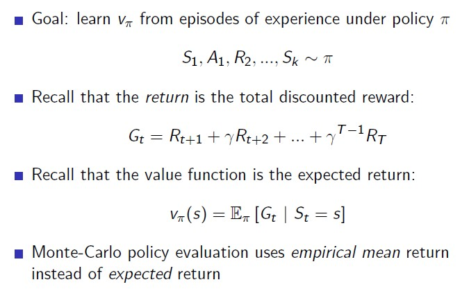

* First-Visit and Every-Visit

    First-Visit: MC에서 한 episode의 특정 state에 대해 Evaluate하는데 있어 처음 방문한 한번에 대해서만 Return을 계산

    Every-Visit: 방문할 때마다, 따로따로 return을 계산

MC는 Episode 내에서 얻는 Return(Gt)를 평균을 사용하여 policy evaluation을 수행한다. 하지만 이는 하나의 샘플이 수행될 때마다 개별적으로 갱신(not sum(S1..St)/N(t) in last time)되기 때문에 "Incremental Mean" 방식으로 계산이 가능하다.

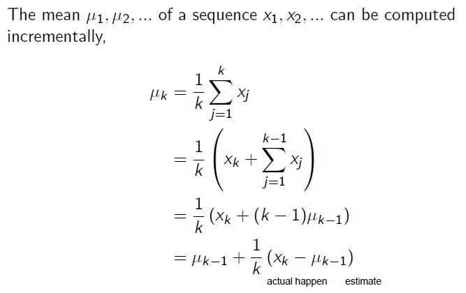
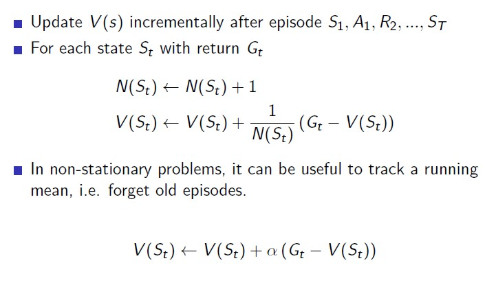

Initial State로부터 멀리있는 State의 Value Function을 계산하는데 있어 계수(alpha: number of states in episode)는 점차 작아진다. 이는 처음 정보들에 대해서는 가중치를 덜 주기 위함이다.

## 4.2. Temporal-Difference Learning

* TD는 episode들로 쌓이는 experience를 학습
* model-free방식: DP 방식과 달리 MDP 전이확률 및 보상에 대한 모든 정보 없이도 학습이 가능
* bootstrapping: terminal state가 없는 불완전한 episode들에 대해서도 학습 가능

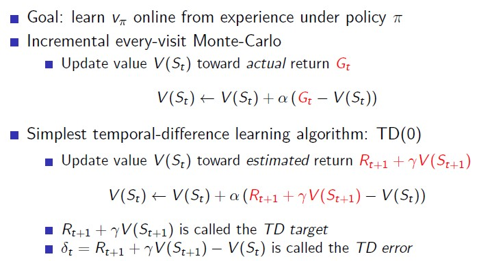

### Comparing Example MC vs TD

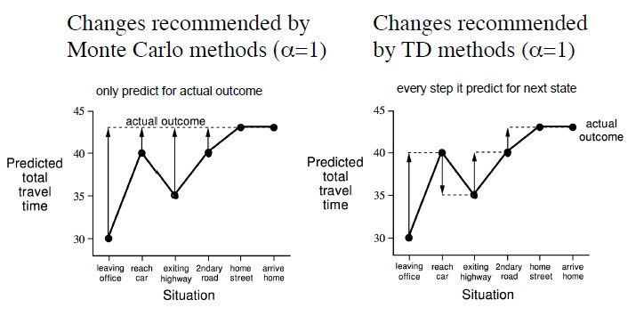

MC는 최종 actual outcome을 추정하는 방향으로 학습을 수행, TD는 매 step의 다음 value를 추정하는 방향으로 학습을 수행.

MC

하나의 episode가 끝나야, update를 할 수 있는 도구가 생긴다. '도구': 지나온 state마다 얻은 reward를 통해 계산한 return 값. 따라서 total reward값과 개별 state reward값을 오차를 활용하여 value function을 update한다.

TD

final outcome을 모르고도 매 step 얻은 reward를 바탕으로 update

### Adv and Disadv of MC vs TD

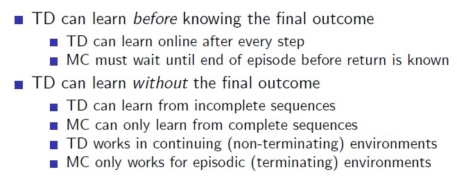
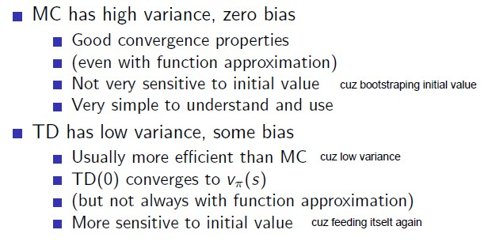

TD는 MC와 달리 episode의 결과가 끝나지 않아도(not terminal state), 학습을 진행할 수 있다. 

TD는 MC에 비해서 variance가 낮아 효율적이다. 그러나 bootstrap 방식을 활용하지 않기 때문에 TD 추정을 통해 사용되는 inital value에 의해 유동적이기 떄문에 bias가 크다.

#### bias and variance

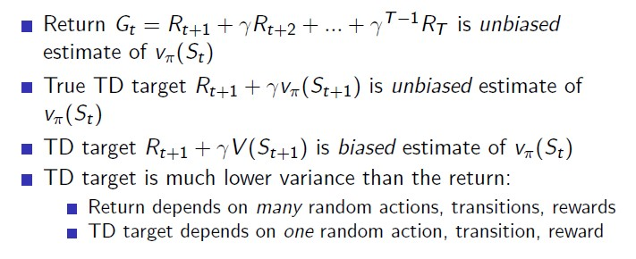

#### Bootstraping and Sampling

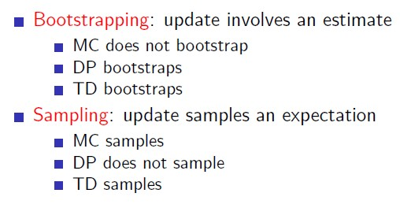

## 4.4. TD(lambda)

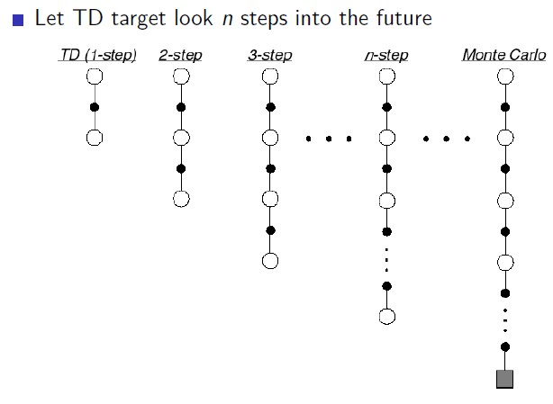

앞서 TD Learning에는 간단한 설명을 위해 TD(0)의 경우에만 진행했다. TD(0)는 임의의 다음 시점의 Reward를 결정하는데 있어 현재 reward + 할인계수 (다음 state의 reward) 와 같이 한 단계 이후의 미래만 고려했다.

그러나 미래를 보는 step의 수를 늘임으로써 TD와 MC 모두의 장점을 가져갈 수 있다. 

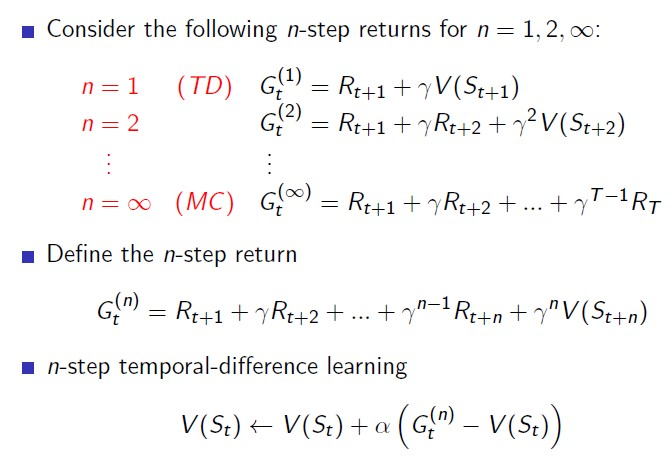

고려하는 step의 수 n을 최대로 늘이게 되면 MC방법과 동일한 방법을 따름을 알 수 있다.

### forward-view TD

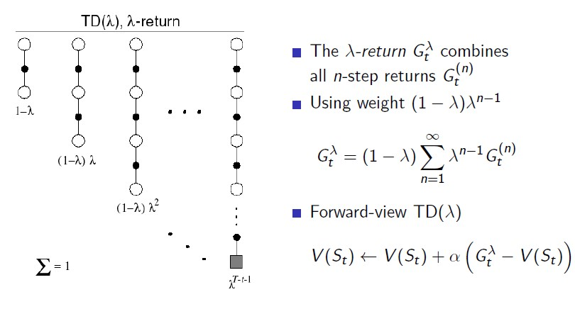

### backward-view TD

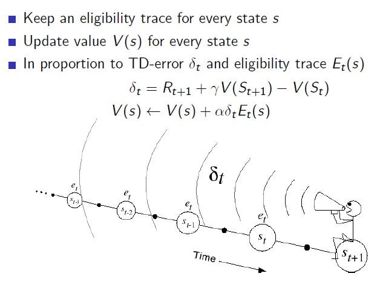