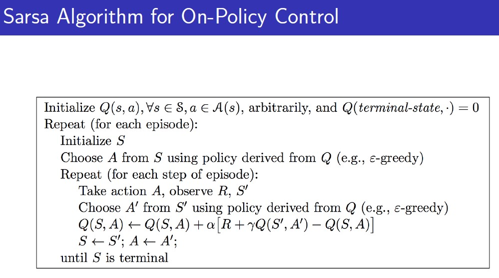
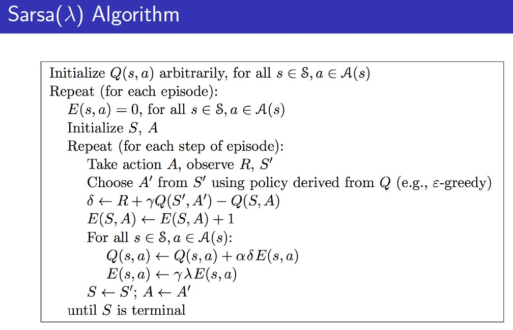

# Model-Free Control

about finding policy

1. Introduction RL
2. MDP
3. Dynamic Programming when env knows.
4. unlike ch3, prediction -> policy를 가지고 value가 어떻게될지
5. 최적의 policy를 찾는것(without no info about env).

==================== 강화학습의 흐름

## Introduction

**On-policy vs Off-policy**

* On-policy: 학습하고자하는 정책과 실제 env로 경험을 쌓는 정책이 동일할 때.

학습 - table을 만들어두고 빈칸을 채우는 형태로.
if -> state가 많게 되면 이를 모두 처리할 수 없기 때문에 **function approximator**라는 개념이 등장(in chap 6,7).
(수많은 state에 대해 대응)

**Two policies**
1. Target policy to be optimized
2. behavior policy for getting experience in environment

* On-policy: 학습하고자하는 정책과 실제 env로 경험을 쌓는 정책이 동일할 때. (i.e. Alpha Go)
* Off-policy: 학습하고자하는 정책과 실제 env로 경험을 쌓는 정책이 동일하지 않을때.
    - 다른 agent의 behavior policy로 학습.

## On-Policy Monte-Carlo Control

**Policy Iteration**
* evaluation: 기존의 policy로 가치 function 을 계산
* improvement: 계산된 가치 function을 greedy한 방식으로 하여 policy를 갱신

**why MC evalution method cannot adapt in Policy Iteration?**

A. MC is Model-Free Method.

V를 가지고 greedy하게 policy를 만드는 것은, 현재 state에서 다음 state들이 가지고 있는 V값을 알고서 이를 maximize한 방향으로 policy를 선택하는 것.

그런데, 다음 state를 안다는 것은 MDP를 안다는 것과 동일하다. MDP를 모른다는 것은 다음 state가 무엇이 될지를 모른다는 것. MC는 MDP를 모르는 상태의 'Model-Free' 방식이기 때문에 Evaluation은 가능하되, Improvement를 적용할 수 없다.

그렇다면, state-value가 아닌, action-value Q에대해서 greedy 하게는 적용할 수 있을까?
using table (State X Action unlike V[State X State])

A. 할 수 있다. 왜냐하면 **특정 state에서 어떤 action을 취할 수 있는지는 Model-Free 방법이라도 알 수 있기 때문.**

**But, "STOCK when doing greedy; lack of exploration"**

**So, e-Greedy Exploration**

* e로 인해 모든 case에 Exploration
* 1-e로 인해 policy를 발전시킬수 있음

e-greedy로도 Policy Improvement가 이루어질 수 있는지?

현재의 state의 action에 대해서는 e-greedy를 따르고, 그 이후의 state의 action에 대해서는 기존 policy를 따르면 한 Step에 대해 Policy Improvement가 가능한지 증명.

if one step is good, in further sight will be good for total sight(in chapter 3).

eq 2nd -> 3rd. q-pi function의 max는 어떤 q-pi function action의 weighted sum보다도 크다(임의의 weight를 지정). The reason of it is for developing 4th line.

Evaluation 단계에서 여러 Episode를 쌓는것이 아니라, 하나의 Episode가 끝나고 이를 활용하여 Improvement를 진행하자. 이 방식을 할 때, 올바른 policy로 근접하기 위한 성질이 필요. 

**It's GLIE**

GLIE = Greedy in the Limit with Infinite Exploration.

첫번째 성질은, 계속 시행을 수행했을때, 모든 state-action pair에 방문을 골고루 하는지에 대한 성질(exploration)

두번째 성질은, 계속 시행을 수행했을때, 결과 policy가 greedy 하게 수렴하는지에 대한 성질(exploitation)

i.e. epsilon = 1/k.

In Evaluation phase, 기존 4장의 MC와 같이 방문시마다 Counter를 증가시키고, 한 Episode가 끝날 때마다 Return 값으로 value function값을 update.

In Improvement phase, using epsilon greedy for epsilon value.

## On-Policy Temporal-Difference Learning

Q는 아직까지는 Table이며, 가로(action) X 세로(state)이다. 

특정 Q값은 Q에서 Action을 취함으로써 얻는 Reward + 그 다음 State에서 다음 Action을 취함으로써 얻는 Action을 가지고 계산한다.

TD Target

TD Error

Policy Evaluation 대신에, Sarsa로 대체하여 Q-fucntion 값을 계산. 그리고, Improvement를 위해서는 epsilon greedy를 활용.

TD가 MC보다 더 극단적인 이유는 한 Step을 움직일 때마다 Policy Improvement를 수행하기 때문이다.

* State X Action으로 구성된 Q-func(배열 till now) Initialize to Q(term, *) = 0 or Q(\*,\*) = random
* Repeat Episode
    * Initialize S(maybe from non-term state randomly)
    * Choose Action by policy what could do.

        Select one value among Q function value of initial state by eplison or greedy (epsilon-greedy method)
    * Repeat per step of Episode
        + Take chosen Action and get Reward and Next State(State-Prime)

            Select one value among Q function value of initial state by eplison or greedy (epsilon-greedy method)

        + Choose Action of Next State(Action-Prime) derived by policy
        + Update Q-function value using by Next State and Next State Action
        + Update S-Prime to S, A-Prime to A
    * Repeat till S is terminal

수렴성을 증명하기 위한 이론.

* GLIE한 성질을 가져야하고,

* Robbins-Monro
    1. 얼마나 업데이트 할지 결정하는 alpha에 있어서 step 1에 대한 alpha부터 무한대의 step의 alpha값을 더하면 무한대가 되어야 한다(step-size가 Q가 얼마나 멀리 있던지 간에 끝까지 이동할 수 있어야 한다.). 

    2. q-value를 수정하는 것이 점점 작아진다(결국 수렴한다).

<b>Windy Grid-world Example</b>

**TD(0), TD(lambda) - forward & backward view**

TD를 수행함에 있어 몇번의 step까지 고려하여 Q-value를 계산할 것인가? n=1이면, 앞서 다룬 Sarsa가 되고, n=무한대이면, MC가 된다. n-step sarsa는 다음 State의 Action을 고려함에 있어서 몇번의 State를 진행할 것인가?를 TD-Target으로 한다.

TD-lambda는 TD를 함에 있어서 n-step의 TD들을 average하여 의사결정에 활용하는 방식. 이를 n-step Q-return qt(n)에 대하여 forward view lambda를 곱하여 summation함으로써 계산. 그러나 이는 시행이 끝나지 않으면 도입할 수 없음.

'eligibility trace': 책임 사유를 묻는 개념. 특정 State를 방문함에 따라 가장 최근에 또는 여러번 방문 하는 것에 사유(가중치)를 두는 것.

특정 state,action pair가 발생할 때마다 count를 수행하고, 이전의 eligibility trace에 대해서는 gamma로 discount한다.

일반 TD방식의 Q-function의 value를 구하는 것과 동일하지만, 책임사유 Et(s,a)가 추가된 것이다(same with Forward view Sarsa by some provement).

Sarsa(lambda)는 기존의 Sarsa와는 Eligibility Trace로 인해 달라진다. 기존의 Sarsa는 특정 s,a에 대한 점만 변경하지만, Sarsa(lambda)는 특정 s,a를 변경할 때, 거쳐온 모든 s,a에 대해서 변경을 수행한다.

계산량에서는 문제가 있지만 정보전파는 빠르다. 

일반 Sarsa는 임의의 다른 reward가 주어지는 순간 그 전 State에 대해서만 Q value가 update된다. 그러나 Sarsa-lambda는 다른 reward를 받는 순간 지나온 모든 경로에 대해서 Q value가 update 된다.

## Off-Policy Learning

behavior policy(mu): action을 sampling하는 policy
target policy(pi): 

target policy를 추정함에 있어서 mu를 통해서 pi를 추정해야 하는 경우. 이 경우에도 학습이 가능하다. 

**특징**
* 따른 Agent의 행동을 관찰(따라하는 것이 아니라, 보고 최적의 판단을 수행)
* policy가 달라도 되므로, 이전의 경험들을 reuse할 수 있다.
* Exploration Action을 하면서, Optimal Policy를 찾을 수 있다(overcoming trade-off). 
* 하나의 Policy로 Multiple Policy 학습을 가능하게 한다.

### Imporatance Sampling

X: state -> 확률 분포 P에 의해서 sampling 되는 값. like 주사위

P: 확률 분포.
Q: 삐뚤어진 주사위?
f: 함수(모든 함수가 가능) -> P를 따르는 함수의 기대값. 

fx의 기대값을 P를 이용(via 확률 시행(주사위 던지기))해서 구하고 싶다. p를 이용해서 던져놓고선 다른 주사위 q를 이용했을때의 기대값을 얻고 싶다. 

마지막 equation이 바로 Q를 따랐을 때의 기대값을 의미함.

다른 분포에 대해서 구하고 싶다면 현재분포 / 다른 분포의 비율을 곱함으로써 가능하다.

Off-Policy 상태의 MC를 계산하기 위해서는 도착했을때 얻는 Gt에 대해서 behavior policy와 target policy의 비율을 계속해서 곱해주면 된다.

그런데, 이는 사용할 수 없다. 왜냐하면 term의 variance가 너무크기 때문이다. 만약 하나의 Episode에 100번 Action을 수행하여 곱하는 분수가 100개가 되는 경우, 대부분 0에 수렴하기 때문에 variance가 너무커서 동작하지 않는다. 그리고 behavior policy(mu)가 0이라면 이 방법을 적용할 수 없다.

따라서, TD에 한하여 방법론을 적용한다. TD는 임의의 state에서 취한 action을 통해 얻은 next state의 action을 통해 얻는 Q function을 활용하기 때문에 MC와 같이 element가 많아지지 않는다(하나의 action만을 반영). 그래서 TD는 Importance Sampling이 가능한 것이다. 

### Q-Learning(in Atari-Game) == sarsa max

TD Learning을 하는데 있어서 (lamdba=1), 다음 State(S+1)의 Action을 뽑는데 있어서 behavior policy가 아닌 target policy를 활용하는 것이다. TD-Learning과 비교했을 때 빨간 부분만 달라진다. 빨간 부분은 '아직 수행하지 않은 예측값'이기 때문에 target policy를 활용하는 것이 가능하다. 

따라서, 현재 State의 Action은 behavior Policy, 다음 State의 Action은 Target Policy로 Q값을 갱신한다.

결국엔 behavior policy도 지정해야 하고, target policy처럼 improve 되어야 한다. 이를 위해 'target policy'는 'Greedy-wise move'하고, 'behavior policy'는 'epsilon-greedy'하게 policy를 최적화한다. 

앞선 sarsa와 비교하면 Q-Learning은 next-state S-prime에서 모든 가능한 Action A-prime을 고려한 max 값을 활용한다는 것이 차이점이다. 

## Summary

